# LIVRE DIGITAL

## DE LA CRÉATION DE LA CAISSE NATIONALE DE RETRAITES ET D'ASSURANCES À AUJOURD'HUI

---

## SOMMAIRE

**PRÉFACE**

1. **INTRODUCTION**

2. **ÉMERGENCE DE LA CAISSE NATIONALE DE RETRAITES ET D'ASSURANCES (1959-1976)**

3. **DÉVELOPPEMENT DES ACTIVITÉS (1977-1997)**

4. **LES GRANDS CHANGEMENTS ET LA MODERNISATION À PARTIR DE 1998**

5. **PARCOURS DE L'INSTITUTION À PARTIR DE 2001**

6. **L'INSTITUTION AUJOURD'HUI**

7. **REGARD VERS L'AVENIR**

8. **PORTRAITS DES DIRIGEANTS ET COLLABORATEURS EMBLÉMATIQUES**

9. **ANNEXES**

---

## Préambule

**🎥 VIDÉO 1**: *Vidéo institutionnelle de 3-4 minutes retraçant l'histoire de la CNRA depuis 1959, avec images d'archives du Maroc post-indépendance, évolution des bâtiments, témoignages d'anciens employés et bénéficiaires, musique institutionnelle marocaine*

Depuis plus de six décennies, la Caisse Nationale de Retraites et d'Assurances (CNRA) s'inscrit au cœur de la construction du système national de prévoyance sociale du Maroc. Son histoire est étroitement liée aux grandes transformations économiques et sociales qu'a connues le Royaume, traduisant l'engagement constant de l'État en faveur de la protection des individus et du renforcement de la solidarité nationale.

Ce livre digital propose un voyage à travers l'histoire de la CNRA, en retraçant les étapes majeures de son évolution, les missions qui lui ont été confiées et les femmes et les hommes qui, au fil du temps, ont contribué à bâtir et consolider cette institution.

Trois intentions essentielles animent cet ouvrage :

### **Célébrer une trajectoire institutionnelle au service du bien commun**

Au fil des pages, le lecteur découvrira comment la CNRA a su, dès ses origines, répondre aux besoins d'une société en mutation, en apportant des solutions concrètes aux enjeux de réparation, de protection et de sécurisation des droits sociaux. Chaque période, chaque réforme, chaque avancée témoigne de la capacité d'adaptation de l'institution face aux attentes de ses bénéficiaires et des pouvoirs publics.

### **Préserver et transmettre une mémoire collective**

La CNRA, à travers ses missions, a accumulé une expertise précieuse dans la gestion des régimes de retraite, de solidarité et de réparation. Ce livre constitue ainsi un témoignage vivant de cette mémoire institutionnelle, destinée à nourrir la compréhension des nouvelles générations, à éclairer les choix d'avenir et à rappeler les fondations solides sur lesquelles s'appuie aujourd'hui le système marocain de prévoyance sociale.

### **Mettre en lumière les valeurs fondatrices de l'institution**

Au-delà de ses activités opérationnelles, la CNRA incarne un ensemble de valeurs qui guident son action au quotidien : l'équité, le sens du service public, la responsabilité, l'intégrité et la solidarité. Portées également par le Groupe CDG, ces valeurs ont façonné l'identité de l'institution et demeurent, aujourd'hui encore, au cœur de ses engagements envers les citoyens et l'État.

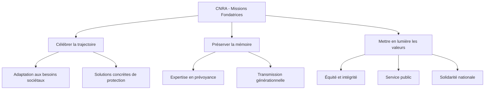

Depuis plus de six décennies, la Caisse Nationale de Retraites et d'Assurances (CNRA) s'inscrit au cœur de la construction du système national de prévoyance sociale du Maroc. Son histoire est étroitement liée aux grandes transformations économiques et sociales qu'a connues le Royaume, traduisant l'engagement constant de l'État en faveur de la protection des individus et du renforcement de la solidarité nationale.

Ce livre digital propose un voyage à travers l'histoire de la CNRA, en retraçant les étapes majeures de son évolution, les missions qui lui ont été confiées et les femmes et les hommes qui, au fil du temps, ont contribué à bâtir et consolider cette institution.

---

## Introduction

### Contexte historique de création de la Caisse Nationale de Retraites et d'Assurances

Au lendemain de l'indépendance, le Maroc s'est trouvé face à un immense chantier : construire un État moderne, unifier le territoire national et poser les fondations d'un développement économique et social autonome. Cette période de reconstruction fut marquée par une volonté politique forte de moderniser les institutions publiques et d'améliorer les conditions de vie des citoyens marocains.

L'un des défis majeurs consistait à réorienter les structures économiques héritées de plusieurs décennies de colonisation, en leur insufflant une dynamique propre, fondée sur des mécanismes internes de création de richesse, d'accumulation de capital et de progrès durable. Il s'agissait de passer d'une économie administrée et dépendante à une économie nationale capable de générer ses propres leviers de croissance.

Dans cette perspective, et afin de consolider la souveraineté nationale tout en stimulant l'investissement, l'État marocain procéda à la création de la Caisse de Dépôt et de Gestion (CDG). Sa mission initiale était double : sécuriser l'épargne réglementée et orienter les ressources collectées vers des investissements structurants pour l'économie et la société.

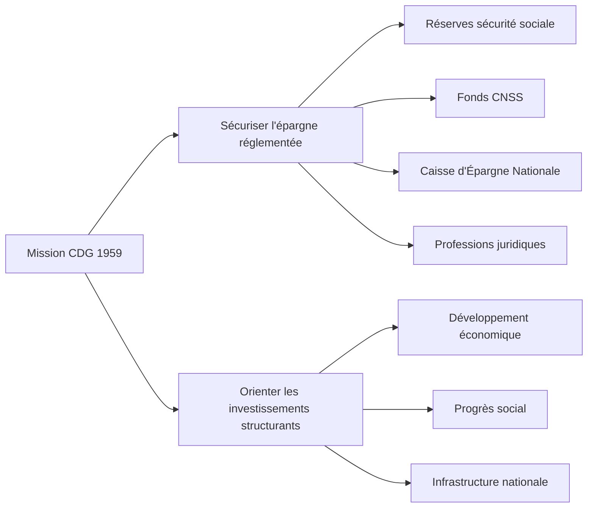

Le champ d'action confié à la CDG couvrait notamment :

- La gestion des dépôts issus des réserves de la sécurité sociale, des fonds collectés par la Caisse Nationale de Sécurité Sociale (CNSS), de la Caisse d'Épargne Nationale (CEN), des professions juridiques (notaires, secrétaires greffiers, avocats...), ainsi que des consignations administratives, judiciaires et des cautionnements.

- La gestion directe de plusieurs organismes publics, dont la Caisse Nationale de Retraites et d'Assurances (CNRA), créée officiellement le 27 octobre 1959, ainsi que du Régime Collectif d'Allocation de Retraite (RCAR), institué par la CNRA en 1977.

Dès sa création, la CNRA s'est vu confier une mission essentielle : contribuer activement à l'édification et au développement du système national de prévoyance sociale. Son action s'est d'abord traduite par la gestion des rentes liées aux accidents du travail et aux accidents de la circulation, versées aux victimes et à leurs ayants droit mineurs. Très vite, son champ d'intervention s'est élargi pour englober la retraite complémentaire, à travers deux dispositifs majeurs : le Régime Complémentaire de Retraite (RECORE) et le Fonds de Retraite des Ordres des Avocats du Maroc (FRAM).

La vocation profondément sociale de la CNRA, combinée à la modernisation continue de ses outils de gestion et de son système d'information, ainsi qu'à sa capacité à conjuguer efficacité, efficience et maîtrise des coûts, lui ont progressivement permis de gagner la pleine confiance des pouvoirs publics. Autant d'atouts qui positionneront l'institution au cœur des réflexions sur la réforme du système de retraite au Maroc, notamment en matière d'élargissement de la couverture à des catégories encore non couvertes.

Dans ce contexte d'évolution des besoins et des attentes, la CNRA a fait des deux axes stratégiques suivants le socle de son développement :

- **Le renforcement de son activité institutionnelle**, par la centralisation de la gestion des rentes accidents du travail (AT) en son sein.

- **Le développement de la retraite** pour les catégories socioprofessionnelles non encore couvertes, en étendant les solutions de prévoyance à des professions et secteurs restés jusque-là en marge des dispositifs classiques.

Historiquement, la mission confiée à la CNRA s'articulait autour de la gestion des assurances de rentes immédiates (viagères ou temporaires) et de rentes différées. Elle avait également pour mandat de recevoir et gérer les capitaux constitués correspondant aux rentes allouées par décisions judiciaires, principalement en réparation des accidents du travail ou de la circulation, mais aussi des accidents de trajet. Par ailleurs, l'évolution de son cadre d'intervention lui a permis d'étendre ses opérations à un ensemble élargi de produits d'assurance garantissant des prestations en cas de vie ou de décès.

Cette dynamique d'expansion trouva un nouveau prolongement décisif avec la création, en 1977, du Régime Collectif d'Allocation de Retraite (RCAR). Ce régime venait combler un vide en matière de couverture sociale en s'adressant à des populations exclues des régimes de retraite existants : personnel non titulaire de l'État et des collectivités locales, personnels contractuels de droit commun, employés d'établissements publics soumis au contrôle financier de l'État, ainsi que salariés de sociétés bénéficiant du soutien financier de l'État ou de collectivités publiques.

Initialement, le RCAR fut mis en place sous la forme d'un régime général obligatoire, auquel est venu s'ajouter, en janvier 1993, un régime complémentaire facultatif. Ce dernier permettait d'offrir des prestations supplémentaires, prolongeant ainsi les revenus d'activité des affiliés en consolidant les prestations vieillesse et invalidité-décès, au-delà du socle servi par le régime de base.

### Vision, Mission et Valeurs de la Branche Épargne – Prévoyance en charge de la gestion de la CNRA et du RCAR

#### Notre Mission

La Branche Épargne – Prévoyance de la Caisse de Dépôt et de Gestion incarne pleinement la vocation de tiers de confiance du Groupe CDG, conformément à ses textes organiques et réglementaires, ainsi qu'à ceux des organismes qui lui sont confiés : la Caisse Nationale de Retraites et d'Assurances (CNRA) et le Régime Collectif d'Allocation de Retraite (RCAR).

Dans ce cadre, la Branche Épargne – Prévoyance exerce ses missions autour de trois grandes expertises complémentaires :

- **La mobilisation de l'épargne**, en sécurisant et valorisant les ressources collectées au profit de la collectivité.

- **La gestion de la prévoyance et des retraites**, en administrant des régimes sociaux au service des assurés et de la solidarité nationale.

- **La gestion des assurances**, en assurant la sécurisation juridique et financière des droits sociaux des bénéficiaires.

#### Notre Vision

Consolider le positionnement de tiers de confiance et affirmer le rôle de gestionnaire de référence des régimes de retraite, des fonds de solidarité et de l'épargne institutionnelle au service de l'intérêt général.

Cette vision s'appuie sur un engagement constant : garantir à la fois la qualité des services rendus, l'intégrité des gestions confiées et l'accompagnement des politiques publiques de développement social.

#### Nos Valeurs

Depuis sa création, la CNRA, sous la gestion de la Caisse de Dépôt et de Gestion, s'est construite autour de valeurs fondatrices qui inspirent chacune de ses actions et orientent ses choix stratégiques. Bien plus que des principes directeurs, ces valeurs constituent l'essence même de la relation de confiance qui unit l'institution à ses parties prenantes :

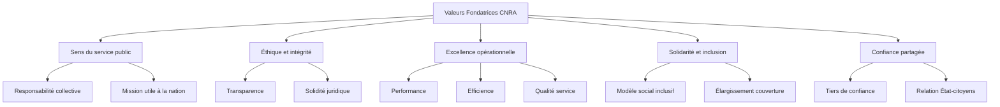

- **Le sens du service public et de la responsabilité collective**, qui engage chaque collaborateur dans une mission utile à la collectivité nationale.

- **L'éthique et l'intégrité**, garantes de la transparence et de la solidité juridique des engagements pris au nom des pouvoirs publics.

- **L'excellence opérationnelle**, traduite par la recherche permanente de performance, d'efficience et de qualité de service.

- **La solidarité et l'inclusion**, piliers du modèle social que l'institution contribue à développer et à élargir depuis plus de soixante ans.

- **La confiance partagée**, qui s'inscrit dans l'ADN même de la CDG et qui confère à la CNRA un rôle singulier de tiers de confiance vis-à-vis de l'État et des citoyens.

Héritière de cette responsabilité depuis les premières années de l'indépendance du Royaume, la CNRA porte aujourd'hui cet engagement avec la même exigence de performance, de rigueur et de devoir au service du bien commun.

---

## Émergence de la Caisse Nationale de Retraites et d'Assurances (1959 – 1976)

### Les premiers objectifs et le rôle fondateur de la CNRA

Créée dans les premières années qui ont suivi l'indépendance, la Caisse Nationale de Retraites et d'Assurances (CNRA) s'est vue confier des missions essentielles pour accompagner la construction progressive du système marocain de prévoyance sociale. Dès l'origine, la CNRA s'est imposée comme un acteur pivot de la protection sociale, avec pour première mission la gestion des rentes versées aux victimes d'accidents du travail (AT) et d'accidents de la circulation, ainsi qu'à leurs ayants droit.

À travers ce mandat, l'institution répondait à une préoccupation sociale majeure : garantir une indemnisation régulière et sécurisée aux personnes victimes d'accidents professionnels, les protégeant ainsi des conséquences financières souvent lourdes qui pouvaient découler de tels sinistres.

Peu à peu, son périmètre d'intervention s'est élargi afin d'intégrer la couverture du risque vieillesse, à travers la mise en place de régimes de retraite complémentaires. Cette extension progressive de ses missions s'est notamment matérialisée par la création du Régime Collectif d'Allocation de Retraite (RCAR), ainsi que du Régime Complémentaire de Retraite (RECORE). Ces dispositifs viendront renforcer les mécanismes de sécurisation des revenus des assurés au moment de leur départ à la retraite.

### 1959 – 1976 : Les premières années d'engagement au service des citoyens

Dans un contexte national encore en reconstruction, la CNRA va très rapidement s'affirmer comme l'un des premiers piliers institutionnels de la protection sociale au Maroc. Tout au long de cette période fondatrice, l'institution s'attache à structurer un système efficace et équitable de gestion des droits sociaux, en assurant la liquidation, le versement et le suivi des rentes dues aux victimes d'accidents de travail.

En versant des rentes trimestrielles aux travailleurs ayant subi des accidents professionnels, la CNRA garantit non seulement un filet de sécurité financière, mais contribue également à préserver la dignité des familles confrontées à des situations de vulnérabilité. Ce soutien concret constitue une réponse essentielle à l'un des enjeux sociaux majeurs de l'époque : protéger les travailleurs marocains des conséquences économiques parfois dramatiques des risques professionnels.

Mais le rôle de la CNRA ne se limite pas à la simple gestion des flux financiers. Dès ses débuts, elle s'impose également comme un gestionnaire rigoureux des capitaux constitutifs provenant des compagnies d'assurances. À travers la fiabilité de ses processus, la transparence de ses pratiques et la solidité juridique de sa gestion, l'institution s'érige en véritable référence du système naissant de prévoyance sociale.

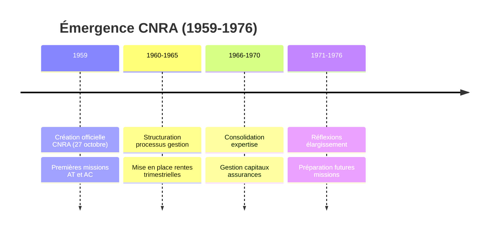

Dès cette première phase de développement, des réflexions s'engagent sur l'élargissement progressif de la couverture sociale à d'autres risques et à d'autres segments de population. Si la gestion des accidents du travail demeure le socle initial de ses missions, la CNRA initie, au fil des années, les premiers travaux en faveur d'une extension de la protection aux risques liés à la vieillesse, à l'invalidité et au décès.

C'est ainsi qu'à partir de cette période, l'institution jette les bases du futur système de retraite national. Une évolution qui s'inscrira dans le prolongement naturel de sa mission fondatrice, et qui connaîtra son premier aboutissement majeur avec la création du RCAR en 1977.

---

## Développement des activités (1977 – 1997)

### 1977 : La création du Régime Collectif d'Allocation de Retraite (RCAR)

L'année 1977 constitue un jalon majeur dans l'évolution de la prévoyance sociale au Maroc, avec la création du Régime Collectif d'Allocation de Retraite (RCAR), confié à la gestion de la Caisse Nationale de Retraites et d'Assurances (CNRA). Ce tournant décisif vient répondre à un besoin crucial de couverture retraite pour des catégories entières de la population active jusque-là en dehors des régimes classiques.

À cette époque, le Maroc connaissait une transition socio-économique importante : la population active augmentait, les trajectoires professionnelles se diversifiaient, et de nombreux salariés exerçaient en dehors des statuts de fonctionnaires ou d'employés relevant de régimes de retraite existants. Face à cette situation, il devenait impératif de proposer un dispositif capable de garantir un revenu décent aux travailleurs en fin d'activité professionnelle.

C'est dans cette optique qu'est né le RCAR, confié à la CNRA dans une logique de continuité de mission et d'expertise. Le nouveau régime s'est adressé principalement à des personnels non titulaires de l'État et des collectivités locales (temporaires, contractuels, occasionnels, journaliers), aux personnels d'établissements soumis au contrôle financier de l'État, ainsi qu'aux salariés d'organismes publics ou privés bénéficiant d'un appui financier de l'État ou de collectivités publiques.

Dans sa configuration initiale, le RCAR fut instauré sous la forme d'un régime général obligatoire, garantissant aux affiliés un revenu de base à l'âge de la retraite. Une réforme importante est intervenue en 1993 avec l'introduction d'un régime complémentaire facultatif destiné aux affiliés dépassant un certain seuil de rémunération et dont les employeurs adhéraient à la convention dédiée. Ce régime complémentaire avait pour objet de prolonger et de compléter les revenus d'activité par des prestations supplémentaires, aussi bien en matière de vieillesse que d'invalidité-décès.

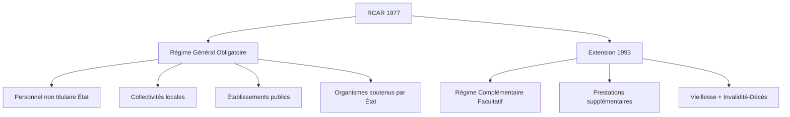

Au-delà de l'innovation institutionnelle, la création du RCAR a marqué une avancée sociale déterminante : en permettant l'élargissement progressif de la couverture retraite à de nouvelles catégories socioprofessionnelles, la CNRA affirmait son rôle de pionnier de la protection sociale et consolidait les bases d'un système marocain de prévoyance plus inclusif, adaptable et solidaire.

---

### 1984 – 1997 : Une stratégie de diversification des produits de prévoyance

#### L'élargissement des missions : gestion des victimes mineures d'accidents de la circulation

En 1984, la CNRA se voit confier une nouvelle mission d'importance sociale, avec la prise en charge de l'indemnisation des victimes mineures d'accidents de la circulation, dans le cadre du Dahir n° 1-84-177 du 2 octobre 1984. En application de cette réforme, la CNRA gère le versement des indemnités sous forme de rentes viagères ou temporaires aux mineurs concernés et à leurs ayants droit, garantissant la sécurisation des fonds jusqu'à leur majorité.

#### 1988 : Lancement du Régime Complémentaire de Retraite (RECORE)

Face aux limites des régimes de base pour assurer un niveau de vie suffisant à la retraite, la CNRA met en place en 1988 le Régime Complémentaire de Retraite (RECORE), conçu sur le principe de la capitalisation collective et d'une adhésion facultative. Ce régime novateur propose :

- une revalorisation annuelle des pensions,
- un caractère viager des prestations,
- un mode de gestion à but non lucratif,
- une transparence exemplaire dans l'administration des cotisations et des prestations.

Avec le RECORE, la CNRA renforce sa capacité à proposer des solutions adaptées aux attentes croissantes des affiliés et à consolider son positionnement d'acteur incontournable de la retraite complémentaire au Maroc.

#### 1991 : Création du Fonds de Retraite des Avocats du Maroc (FRAM)

En 1991, la CNRA étend son expertise en créant un dispositif dédié aux Ordres des Avocats du Maroc : le Fonds de Retraite des Avocats du Maroc (FRAM). Ce fonds permet d'assurer des prestations de retraite, d'invalidité et de décès aux avocats titulaires et stagiaires, en leur offrant un cadre sécurisé d'épargne retraite adapté à leur profession.

#### 1993 – 2000 : Développement des gestions mandatées

Forte de sa capacité de gestion, la CNRA est progressivement sollicitée pour prendre en charge d'autres dispositifs spécifiques :

• En 1993, une convention est conclue avec le Barreau de Casablanca pour gérer un fonds autonome de retraite au bénéfice des avocats de la juridiction.

• En 1994, la Chambre des représentants confie à la CNRA la gestion de son propre régime de retraite (RRMCR), puis en 2000, celle du régime de la Chambre des conseillers (RRMCC).

Ces régimes spécifiques assureront le versement de pensions aux parlementaires en fin de mandat, jusqu'à leur liquidation progressive à partir de 2017 pour la première chambre et de 2022 pour la seconde.

#### 1995 : Création du système « Addamane Al Hirafi »

Toujours dans sa logique d'innovation sociale, la CNRA développe en 1995, en partenariat avec le ministère de l'Industrie, la CNIA et la Banque Centrale Populaire, un produit de prévoyance ciblé pour les commerçants, artisans et professions libérales sous la marque « Addamane Al Hirafi ». Ce système de couverture sociale est diffusé à travers les réseaux bancaires, les compagnies d'assurance et les chambres professionnelles, renforçant ainsi l'inclusion sociale de segments jusqu'alors peu ou pas couverts.

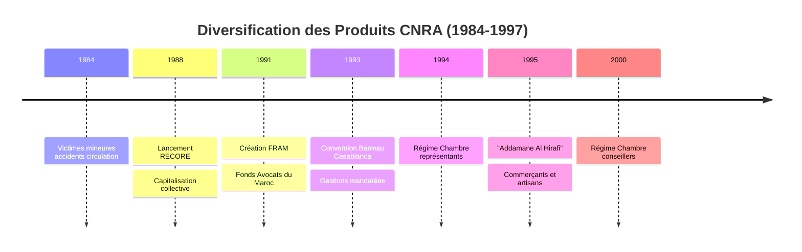

---

### Implantation régionale : renforcer la proximité avec les assurés

Dans le cadre de sa politique de proximité et d'amélioration du service aux usagers, la CNRA procède à l'ouverture d'agences régionales stratégiquement implantées :

- **Rabat**, capitale administrative, au plus près des institutions publiques.
- **Casablanca**, capitale économique, au service d'une population active dense et diversifiée.
- **Laâyoune**, garantissant une présence au sud du Royaume pour les populations sahariennes.
- **Jerada**, offrant un accompagnement de proximité aux bénéficiaires des rentes accidents du travail et maladies professionnelles dans le nord-est du pays.

Cette organisation territoriale traduit la volonté constante de la CNRA de rapprocher ses services des citoyens et de garantir un accompagnement personnalisé et efficient.

---

## Les grands changements et la modernisation à partir de 1998

### Le lancement du programme de modernisation

La modernisation du service public marocain représente, depuis la fin des années 1990, un enjeu majeur dans la consolidation de la compétitivité et du développement national. Consciente de cette dynamique et fidèle à sa vocation de service au citoyen, la Caisse Nationale de Retraites et d'Assurances (CNRA) s'est engagée dès 1998 dans une transformation en profondeur de son organisation et de ses modes de gestion.

**🎥 VIDÉO 2**: *Vidéo de 5 minutes sur la transformation digitale de la CNRA : évolution des systèmes informatiques des années 1990 à aujourd'hui, témoignages d'employés et d'usagers sur l'amélioration des services, démonstration des applications mobiles et services en ligne, interviews de dirigeants expliquant la stratégie de modernisation*

L'objectif de cette mutation est clair : positionner durablement l'institution comme un acteur de référence de la prévoyance sociale moderne et performante, au service des citoyens et des pouvoirs publics.

Dès les premières étapes de ce chantier ambitieux, plusieurs axes structurants ont été identifiés :

- Simplification et fluidification des procédures internes ;
- Digitalisation et virtualisation des services ;
- Consolidation de l'orientation client ;
- Développement et valorisation des compétences humaines ;
- Renforcement de la gouvernance et des dispositifs de contrôle ;
- Ancrage de la transparence et de l'éthique de gestion dans l'ensemble des processus.

Ce programme de transformation, d'abord amorcé en 1998, prend une nouvelle dimension dès 2003, puis s'intensifie fortement à partir de 2006, traduisant la détermination de la CNRA à répondre aux nouvelles exigences institutionnelles et sociétales du pays.

### Un virage stratégique fondé sur l'excellence opérationnelle

Après plus de quarante années d'expérience dans la gestion de régimes diversifiés, la CNRA initie à partir de 2003 une révision de son business model en profondeur. Cette évolution stratégique repose sur un socle de principes issus du management par la qualité totale (TQM), s'appuyant notamment sur :

- Une optimisation continue des processus internes ;
- Une modernisation des pratiques de gestion des ressources humaines ;
- Une gouvernance renforcée et structurée autour d'indicateurs de performance ;
- Une approche centrée sur l'écoute et la satisfaction des bénéficiaires.

Afin de piloter cette montée en puissance, la CNRA déploie des outils modernes de gestion stratégique, en particulier le Balanced Scorecard pour la mesure de la performance globale et le Program Management Office (PMO) pour la gouvernance de ses projets structurants.

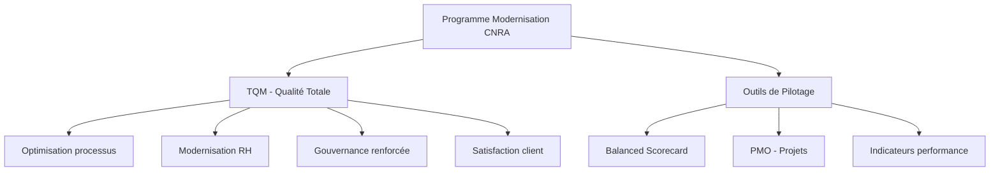

Cette organisation permet à la CNRA non seulement de répondre aux exigences des réformes nationales en matière de retraite et de protection sociale, mais aussi de préparer l'institution à faire face à des attentes de plus en plus exigeantes de la part de ses assurés et partenaires : réactivité, personnalisation, simplicité d'accès et qualité du service rendu.

### Des leviers opérationnels structurants pour accompagner la transformation

Pour garantir la réussite de cette transformation, plusieurs leviers stratégiques ont été activés, constituant les fondations du nouveau modèle de gestion de l'institution :

1. **Un système d'information modernisé**, aligné sur les standards internationaux, offrant des capacités accrues de gestion, de fiabilité des données et d'interopérabilité.

2. **Une maîtrise opérationnelle renforcée**, à travers une certification progressive ISO 9001, assurant la qualité constante des prestations et des traitements, dans le respect des référentiels internationaux de la qualité.

3. **Des ressources humaines qualifiées et engagées**, bénéficiant de programmes de formation continue, et contribuant activement à l'adaptation de l'institution aux nouveaux défis.

4. **Une relation client institutionnalisée et renforcée**, soutenue par une communication de proximité et des dispositifs d'écoute continue, visant à développer un climat de confiance durable entre la CNRA et ses assurés.

---

### Consolidation de la transformation digitale et élargissement des services (2003 - 2012)

Dans la continuité de son programme de modernisation, la CNRA franchit une nouvelle étape déterminante avec l'introduction progressive de solutions numériques avancées, visant à fluidifier ses opérations et à améliorer durablement l'expérience de ses clients.

L'intégration de la Gestion Électronique des Documents (GED) et la mise en œuvre de circuits de traitement automatisés via le workflow constituent un tournant majeur dans la refonte des processus internes. Cette dématérialisation progressive des flux permet non seulement de simplifier les démarches administratives, mais également d'optimiser le traitement des dossiers, d'en améliorer la traçabilité et de renforcer la rapidité des services rendus.

Parallèlement, dans un souci constant d'amélioration de la transparence et de l'autonomie des affiliés, la CNRA met à disposition des adhérents du régime RECORE un espace client en ligne. Cette plateforme numérique leur permet de consulter en temps réel leur situation individuelle, d'accéder à leurs relevés, et de suivre de manière sécurisée l'évolution de leurs droits à la retraite.

Cette avancée technologique place ainsi la CNRA à l'avant-garde des pratiques de gestion des régimes de prévoyance sociale, en offrant une relation client de plus en plus fluide, interactive et accessible.

### Renforcement continu du système qualité et des outils de gestion

Tout au long de ces années, la CNRA poursuit également une politique rigoureuse de certification et d'amélioration continue de la qualité. Parmi les principales avancées réalisées :

- Le perfectionnement constant du système d'information pour accompagner l'évolution des régimes gérés ;
- L'obtention progressive des certifications ISO 9001 V 2000, d'abord sur les activités des rentes, puis sur le régime RECORE, attestant de la conformité aux standards internationaux en matière de qualité de service ;
- La dématérialisation étendue des processus relatifs à la gestion des rentes et des assurances collectives, favorisant l'accélération des traitements et la sécurisation des données.

En 2007, le déploiement du système d'information IRADAT marque une nouvelle avancée stratégique. Véritable colonne vertébrale opérationnelle, cette solution permet d'automatiser davantage le traitement des rentes et d'améliorer la sécurisation des informations sensibles, tout en intégrant parfaitement la Gestion Électronique des Documents (GED).

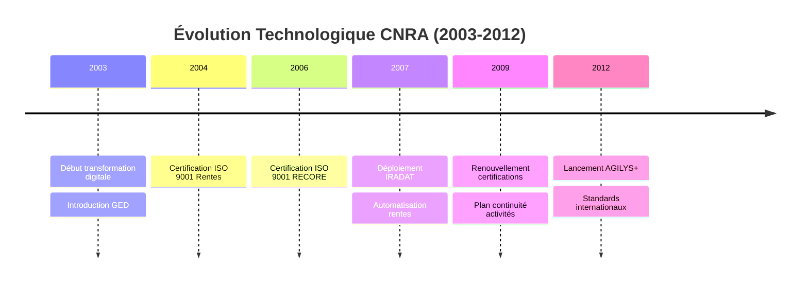

Les résultats de ces transformations ne tardent pas à se traduire par des indicateurs de performance particulièrement significatifs : un taux de satisfaction des affiliés RECORE de 92%, et un taux de satisfaction de 79% pour les bénéficiaires des rentes accidents du travail et de la circulation, confirmant l'impact positif des actions de modernisation.

L'année 2009 confirme la montée en puissance du programme de modernisation avec :

- Le renouvellement des certifications ISO 9001 version 2008 pour l'activité Rentes AT et AC,
- La poursuite des projets informatiques majeurs autour d'IRADAT et de SIDAC pour les assurances collectives,
- L'actualisation de la cartographie des risques,
- Et le lancement du chantier du plan de continuité d'activités, garantissant la résilience des opérations de la Caisse face aux aléas potentiels.

Cette période est marquée également par la mutualisation des infrastructures informatiques du RCAR et de la CNRA, incluant :

- des systèmes de qualité et de planification,
- un centre d'acquisition numérique,
- des dispositifs avancés de workflow automatisé,
- un PMO centralisé pour le pilotage des projets,
- ainsi qu'un système performant de planification des ressources.

En 2012, une étape décisive est franchie avec le lancement de la nouvelle plateforme AGILYS+, conçue selon les meilleurs standards internationaux. Alliant puissance technologique et flexibilité organisationnelle, elle permet à la CNRA de gérer des volumes d'activité croissants, tout en maintenant une qualité de service optimale et une agilité opérationnelle au service de l'intérêt général.

---

### Accélération des services numériques et ancrage d'une nouvelle culture de gestion (2012 - 2018)

Poursuivant sa dynamique de transformation, la CNRA engage en 2012 de nouvelles avancées structurantes. La mise en service du Centre Relation Client (CRC), adossé à un dispositif CRM entièrement intégré au back-office, marque un jalon supplémentaire dans l'amélioration de la qualité de service et de la relation de proximité avec les affiliés et les partenaires institutionnels. Cette organisation permet de fluidifier les échanges, de mieux tracer les demandes et d'accroître la réactivité des services.

#### Premiers services mobiles : vers un accès simplifié aux droits des affiliés

En 2013, fidèle à sa démarche d'innovation au service du citoyen, la CNRA lance deux applications mobiles pionnières, SMART CNRA et SMART RCAR, interconnectées au système CRM. Ces nouveaux outils offrent aux affiliés un accès permanent et sécurisé à une large gamme de e-services : consultation des situations de compte, simulations de droits, demandes d'attestations ou d'informations, dépôt de réclamations... Accessibles à tout moment via mobile, site web ou réseaux sociaux, ces applications posent les bases d'une interaction fluide et dématérialisée avec les assurés.

L'année 2014 confirme ce virage numérique avec le déploiement d'un nouveau système Relation Client, venant compléter et dépasser les capacités du CRM initial. Hautement paramétrable, plus intuitif et plus réactif, ce système confère à la CNRA une flexibilité renforcée, capable de s'adapter aux besoins différenciés des divers publics servis. Il constitue un levier d'efficacité et de personnalisation des services délivrés, en cohérence avec les exigences croissantes des usagers.

#### Une plateforme multi-fonds, au service des grandes réformes sociales

Tout au long de l'année 2015, la CNRA confirme sa capacité à accompagner les pouvoirs publics dans les chantiers structurants de développement de la prévoyance sociale nationale. Sa plateforme de gestion multi-fonds et multi-régimes devient progressivement un outil stratégique mis à la disposition de l'État pour favoriser l'élargissement de la couverture sociale et garantir une gestion équitable et efficace des différents dispositifs sociaux.

Cette démarche d'innovation et de qualité est couronnée par l'obtention, en 2015, du prix d'excellence e-Mtiaz, dans les catégories « centre d'appel » et « e-contenu ». Une reconnaissance qui atteste de la performance de l'écosystème numérique déployé et consacre la CNRA comme acteur de référence dans la modernisation des services publics.

#### Consolidation des certifications qualité et système de gouvernance

En 2016, la CNRA franchit un nouveau palier d'excellence organisationnelle en obtenant la double certification :

- **ISO 9001 version 2015** pour l'ensemble de son Système de Management de la Qualité (SMQ), couvrant l'intégralité de ses produits et services,
- **OHSAS 18001 version 2007** pour son Système Santé et Sécurité au Travail.

L'obtention de ces certifications sans non-conformité ni réserve traduit la maturité du modèle de gouvernance, l'agilité du système d'information et l'ancrage de l'orientation client au cœur de ses pratiques managériales.

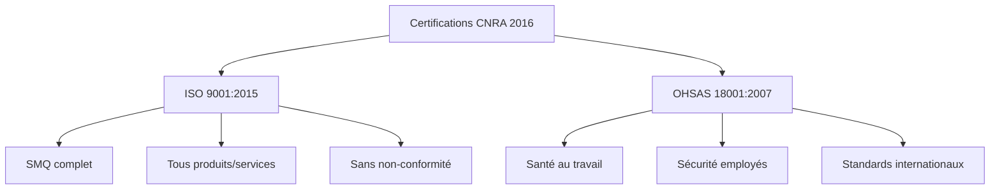

#### Vers une transformation digitale renforcée et une interaction élargie avec les bénéficiaires

En 2017, dans une logique de projection vers l'avenir, la CNRA engage une réflexion approfondie autour de la consolidation de « l'Usine Prévoyance CDG », en intégrant pleinement les enjeux d'agilité, de digitalisation et de qualité de service. Cette ambition se concrétise notamment par :

- Le développement de nouveaux téléservices à haute valeur ajoutée, offrant aux affiliés un suivi détaillé de l'état d'avancement de leurs dossiers via leurs espaces clients en ligne,
- Le lancement de nouvelles interfaces numériques d'information, avec la création de la Web Radio et de la Web TV institutionnelles, véritables canaux interactifs de communication et de vulgarisation des droits.

L'année se conclut par la reconduction, sans réserve, de la double certification qualité (ISO 9001 v2015 et OHSAS 18001 v2007), confirmant l'efficience du dispositif global de pilotage.

#### Un positionnement stratégique conforté (2018)

En 2018, la CNRA adopte une feuille de route ambitieuse plaçant l'efficacité opérationnelle au centre de ses priorités stratégiques. L'objectif est clair : garantir un modèle de gestion durable, performant et agile, à même de soutenir les grandes réformes nationales de prévoyance sociale, tout en anticipant les défis futurs liés à l'évolution démographique et économique.

Cette orientation s'appuie résolument sur :

- La poursuite de la digitalisation des processus,
- L'optimisation continue des ressources,
- Le renforcement de la qualité de service rendu,
- Et l'approfondissement de la transparence dans la gouvernance des fonds sous gestion.

---

### Consolidation du virage digital et montée en puissance des innovations sociales (2019 - 2022)

À partir de 2019, la CNRA intensifie sa dynamique de transformation, consolidant ses acquis en matière d'efficacité opérationnelle tout en poursuivant l'adaptation continue de ses processus aux attentes croissantes des bénéficiaires et des pouvoirs publics.

L'année 2019 marque ainsi une étape charnière dans l'alignement stratégique de l'institution, avec un accent fort mis sur :

- La modernisation de l'administration publique,
- L'amélioration de la qualité des services rendus aux citoyens,
- La protection renforcée des populations les plus vulnérables.

La mise en œuvre satisfaisante de la feuille de route 2018-2022 témoigne de cette volonté de transformation continue, dans un environnement toujours plus exigeant, où la gestion de la volumétrie des données et la sophistication des besoins des usagers requièrent des solutions numériques robustes et agiles.

#### Lancement des solutions d'innovation ouverte

Dans ce contexte, la CNRA initie la première édition du programme Open Innovation "Prévoithon 2019", déployant un ensemble d'applications numériques de nouvelle génération parmi lesquelles :

- **Sarout e-htiyati**
- **Chat e-htiyati**
- **WhatsApp e-htiyati**
- **Allo e-htiyati**
- **Selfie e-htiyati**

Ces solutions participent à l'amélioration de l'accessibilité des services et à l'enrichissement de l'expérience usager, en permettant des interactions simplifiées, instantanées et fluides.

En parallèle, le lancement du projet institutionnel « ONE CDG » engage une évolution profonde des pratiques managériales, fondée sur une gouvernance plus collaborative, transversale et décloisonnée, favorisant la synergie des compétences et l'intelligence collective au sein du groupe.

Dans la même logique d'ouverture et de stimulation de l'innovation, l'organisation du Hackathon de l'innovation dans le domaine de la prévoyance illustre la capacité de la CNRA à mobiliser des énergies créatives autour des enjeux de protection sociale.

#### Déploiement du système AGILYS 2.0 et renforcement de la résilience organisationnelle

Toujours en 2019, la CNRA initie le déploiement du nouveau système d'information AGILYS 2.0, conçu comme une solution modulaire et évolutive, capable de couvrir l'intégralité des produits de prévoyance, avec une forte capacité d'adaptation aux futures extensions des régimes sociaux. Cette infrastructure assure à l'institution une flexibilité opérationnelle durable et une évolutivité constante de son offre de services.

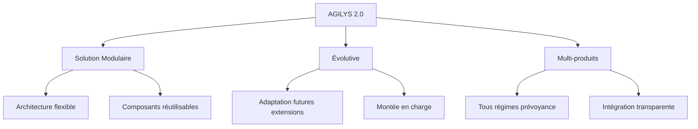

#### Une résilience numérique éprouvée face à la crise sanitaire (2020)

Lorsque la crise mondiale du COVID-19 frappe en 2020, la CNRA démontre immédiatement la robustesse de son modèle de gestion, soutenu par l'agilité de ses systèmes numériques et l'anticipation de ses dispositifs de gestion des risques.

Grâce à sa plateforme digitale multi-produits, la CNRA réussit à maintenir la continuité intégrale de ses activités, en dépit des contraintes sanitaires et de distanciation sociale. Ses affiliés et partenaires continuent ainsi à accéder sans rupture aux prestations et aux services, que ce soit en matière de retraite, de rentes ou de gestion de fonds de solidarité.

Au-delà de la continuité de service assurée durant cette période, l'année 2020 est également marquée par plusieurs avancées techniques majeures, parmi lesquelles :

- La poursuite du développement de la plateforme AGILYS 2.0,
- La digitalisation des processus de gestion des partenaires (plateformes Safakat, e-facture, bureau d'ordre électronique),
- L'obtention de la certification ISO 9001 et du certificat d'excellence AISS,
- L'extension de l'infrastructure IT, avec l'étude de création d'un Security Operations Center (SOC),
- La consolidation de la gouvernance de sécurité par la mise en œuvre du Système de Management de la Sécurité de l'Information (SMSI) en vue de la certification ISO 27001,
- Le déploiement du bouquet digital élargi e-htiyati,
- L'obtention de la certification ISAE TYPE II sur la ligne métier « gestion des investissements ».

#### Maturité numérique et accélération de la transformation interne (2021)

L'année 2021 conforte la position de la CNRA comme plateforme de gestion technique, opérationnelle et financière intégrée, au service de la performance et de la proximité citoyenne.

La pleine maturité atteinte par les services e-htiyati, largement adoptés par les usagers, illustre l'appropriation croissante des solutions numériques par les citoyens, validant ainsi la pertinence des choix stratégiques opérés en amont.

Cette dynamique permet à la CNRA de franchir de nouvelles étapes structurantes dans l'optimisation de ses processus internes, tout en poursuivant le développement de nouveaux projets d'innovation, en étroite articulation avec les orientations nationales de généralisation de la protection sociale.

#### Clôture du plan stratégique 2018-2022 et stabilisation de l'écosystème numérique (2022)

L'année 2022 marque l'achèvement du plan stratégique 2018-2022, résolument axé sur l'innovation, l'utilité publique, la transformation digitale et l'amélioration continue du service citoyen.

Cette séquence s'illustre notamment par le déploiement à grande échelle de AGILYS 2.0 pour l'ensemble des régimes de retraite, fruit de plusieurs années de mobilisation collective et de développement agile. Ce nouveau système intègre des innovations tant technologiques que métiers, visant à assurer :

- Une gestion simplifiée et centralisée des processus,
- Une capacité d'adaptation permanente,
- Une optimisation des coûts de gestion,
- Une meilleure réactivité aux réformes sociales à venir

---

## 2022–2023 : Consolidation du rôle de tiers de confiance et acteur stratégique des politiques publiques

En 2022, la CNRA confirme pleinement sa vocation de tiers de confiance et d'architecte de solutions publiques, en s'affirmant comme un acteur central dans l'accompagnement des pouvoirs publics, tant sur les volets d'inclusion sociale que de modernisation financière et numérique.

Grâce à la maîtrise des technologies digitales avancées et à la mobilisation de réseaux de partenaires institutionnels et bancaires, la CNRA assure la gestion optimale du programme « Tayssir », en garantissant une allocation fluide, sécurisée et rigoureuse des aides, tout en optimisant les coûts de gestion. En parallèle, l'institution veille à maintenir un haut niveau de qualité de service et de proximité avec les bénéficiaires, en conformité avec les standards de performance fixés par l'État.

, les montants, et l'impact social avec statistiques et icônes éducatives)

Toujours en 2022, dans un souci constant de sécurisation des données et des interactions numériques au profit des usagers, la CNRA signe, aux côtés de la CDG, une convention stratégique avec la Direction Générale de la Sûreté Nationale, permettant d'exploiter la plateforme « Tiers de confiance » reposant sur la Carte Nationale d'Identité Électronique. Cette avancée renforce davantage la sécurité des transactions et illustre la détermination de l'institution à inscrire l'ensemble de ses processus dans une démarche de fiabilité et de transparence accrue.

### 2023 : Montée en puissance dans l'accompagnement des grands chantiers sociaux du Royaume

L'année 2023 constitue un tournant dans l'évolution du paysage social marocain, avec l'élargissement historique de la couverture sociale pilotée sous l'impulsion des plus hautes autorités du Royaume. Forte de l'expertise acquise dans la gestion du programme « Tayssir », la CNRA est appelée à jouer un rôle déterminant dans la concrétisation de ce chantier structurant, en étendant son savoir-faire à d'autres dispositifs d'envergure.

Ainsi, l'institution prend en charge la gestion opérationnelle de trois nouveaux programmes majeurs :

- **Les Aides Sociales Directes** ;
- **L'Aide au Logement (Daam Sakane)** ;
- **Le fonds d'aide relatif au Séisme d'El Haouz**.

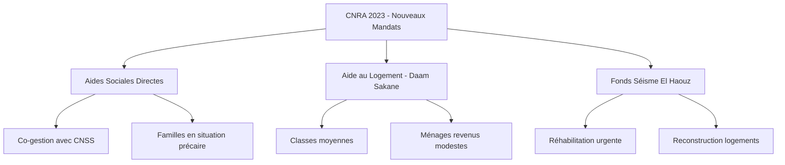

Pour chacun de ces dispositifs, la CNRA mobilise des solutions numériques performantes et intégrées, conçues et déployées en interne, garantissant à la fois :

- Une accessibilité facilitée et dématérialisée des services pour les bénéficiaires,
- Une distribution rapide, fluide et sécurisée des aides financières, via des plateformes interconnectées aux réseaux d'établissements de paiement,
- Une gestion transparente et rigoureuse des fonds, répondant aux plus hauts standards de traçabilité et de gouvernance publique.

Par cette capacité à répondre avec agilité aux priorités nationales, la CNRA confirme une nouvelle fois sa pleine mobilisation au service des grandes réformes sociales, contribuant ainsi à l'amélioration tangible des conditions de vie des citoyens.

### Une gouvernance consolidée par l'innovation et la confiance publique

L'implication croissante de la CNRA dans ces projets stratégiques de grande envergure consacre la confiance renouvelée des autorités publiques à son égard --- confiance bâtie année après année autour de ses atouts fondamentaux : expertise opérationnelle, pragmatisme, agilité organisationnelle, capacité d'innovation et culture du résultat.

Son agilité à adapter ses process, sa solidité technologique et la transparence de ses opérations renforcent la crédibilité de ses actions auprès des bénéficiaires et des institutions nationales.

À travers l'investissement massif consenti par le Royaume dans l'élargissement de la protection sociale, c'est tout un nouveau cadre de développement humain et d'inclusion sociale qui se dessine progressivement. La CNRA s'inscrit pleinement dans cette dynamique structurante, participant à la préparation des réformes à venir en faveur d'une couverture plus large, plus équitable et plus inclusive de l'ensemble des citoyens.

### Vers une prévoyance sociale de nouvelle génération

En conclusion, la profonde transformation numérique des services sociaux appelle aujourd'hui à un renouvellement permanent des approches métiers. Les attentes des citoyens évoluent, les pratiques se digitalisent, et de nouvelles opportunités émergent autour :

- de la dématérialisation intégrale des flux,
- de l'automatisation avancée des processus,
- de la robotisation et de l'intelligence décisionnelle,
- de l'intégration progressive de l'intelligence artificielle et des objets connectés au service de la prévoyance sociale.

Par son engagement constant à anticiper ces mutations, la CNRA confirme sa capacité à accompagner durablement l'évolution du système national de protection sociale et à proposer des modèles de gestion toujours plus performants, agiles et sécurisés.

---

## Transformation digitale et extension des missions institutionnelles

### Un virage numérique pleinement intégré au service des parties prenantes

Dès le début des années 2000, la CNRA a fait de la transformation digitale un levier stratégique essentiel, avec une ambition claire : moderniser ses processus, fluidifier les échanges et améliorer l'expérience de l'ensemble des usagers, qu'ils soient affiliés, employeurs, partenaires institutionnels ou collaborateurs internes.

La période 2007-2012 a constitué une première accélération, marquée par la dématérialisation des services et des interactions avec les clients, ouvrant ainsi la voie à un système d'information plus agile, ouvert et évolutif.

En ligne avec cette dynamique, la transformation digitale s'est articulée autour de trois axes structurants :

- **Pour les employeurs** : simplification et optimisation des démarches administratives ;
- **Pour les affiliés et bénéficiaires** : accès sécurisé, services personnalisés et renforcement de l'expérience usager ;
- **Pour les collaborateurs** : outils numériques performants visant à accroître la productivité et l'efficacité.

Dans cette perspective, des méthodes innovantes telles que le design thinking ont été progressivement adoptées pour favoriser la co-construction de nouveaux services.

En 2019, cette dynamique d'innovation a franchi un nouveau cap avec l'organisation du premier Hackathon de la Prévoyance -- "Prévoithon". Réunissant startups, experts métiers et collaborateurs internes, cet événement a permis de concevoir, en mode collaboratif, de nouvelles solutions digitales, pleinement alignées avec les besoins émergents des citoyens et des parties prenantes.

---

## 2001-2024 : Renforcement du rôle institutionnel de tiers de confiance

### Diversification des missions et accompagnement des pouvoirs publics

Depuis 2001, la CNRA a continuellement élargi son périmètre d'intervention, consolidant sa position de tiers de confiance au service des politiques publiques et de la solidarité nationale.

- En 2001, elle est mandatée pour gérer le **Fonds Marocain de Placement**, destiné à indemniser les ayants droit des soldats marocains ayant participé à la guerre du Golan.

- Entre 2002 et 2004, plusieurs conventions sont signées avec des organismes publics (ONCF, DRAPOR, ODEP) pour la prise en charge de régimes de rentes spécifiques.

- En 2004, la CNRA prend en charge la gestion du contentieux des **Charbonnages du Maroc**, en lien avec les autorités de tutelle et l'ONHYM.

Dans le cadre de l'amélioration de la gouvernance et de la clarté organisationnelle, une nouvelle structuration est mise en œuvre dès 2006, selon une logique de segmentation par métiers, permettant de renforcer l'efficience opérationnelle.

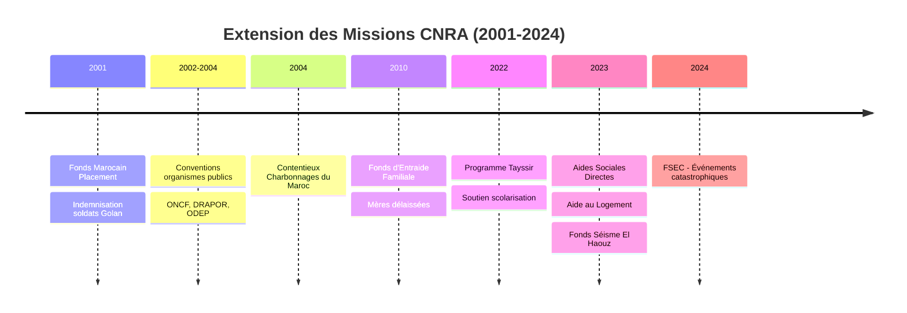

Parmi les priorités de développement engagées :

- **Centralisation des rentes AT** au sein de la CNRA,
- **Déploiement du régime RECORE** à de nouveaux publics,
- **Intégration progressive des caisses internes** de retraite (OCP, ONE),
- **Extension du FRAM** aux professions libérales.

Sur le plan réglementaire, une refonte des textes encadrant l'activité institutionnelle est finalisée dès 2009.

### Engagement renforcé dans les dispositifs sociaux à haute portée humaine

En 2010, la CNRA se voit confier la gestion du **Fonds d'Entraide Familiale (FEF)**, destiné à soutenir les mères délaissées et les enfants en situation de vulnérabilité, dans le cadre des efforts gouvernementaux en faveur de la cohésion sociale.

Cette mission sera élargie en 2018 pour intégrer de nouveaux bénéficiaires, témoignant de la volonté de renforcer la solidarité nationale.

---

### 2022-2024 : Nouveaux mandats au service des réformes sociales d'envergure

Dans le prolongement de son expertise consolidée en prévoyance sociale, la CNRA est de nouveau sollicitée pour porter des dispositifs structurants :

• En 2022, la gestion du **programme « Tayssir »** lui est confiée, avec pour objectif de soutenir la scolarisation des enfants issus de familles défavorisées et de lutter contre la déperdition scolaire.

Ce programme s'inscrit dans la politique gouvernementale visant l'égalité des chances et la réforme du système éducatif, tout en intégrant les principes d'inclusion sociale, financière et numérique.

La même année, la CNRA organise, sous le Haut Patronage de Sa Majesté le Roi Mohammed VI, le **Forum mondial de l'AISS**, réunissant la communauté internationale autour des enjeux d'innovation et de durabilité en sécurité sociale, dans un contexte post-pandémique déterminant.

• En 2023, dans le cadre du déploiement du chantier royal d'élargissement de la protection sociale, la CNRA est mandatée pour piloter plusieurs nouveaux dispositifs sociaux d'envergure :

- Le **programme d'urgence de réhabilitation et de reconstruction** des logements détruits à la suite du séisme d'Al Haouz,
- Le **programme des Aides Sociales Directes (ASD)** en co-gestion avec la CNSS,
- Le **programme d'aide directe au logement (DAAM SAKANE)**, en faveur des classes moyennes et des ménages à revenus modestes.

- En 2024, un nouveau mandat lui est attribué : la gestion, pour le compte du **Fonds de Solidarité contre les Événements Catastrophiques (FSEC)**, des procédures d'indemnisation des victimes d'événements catastrophiques non couverts.

---

### Vers une nouvelle feuille de route stratégique -- CAP 2030

Forte de plus de 60 ans d'expertise, la CNRA constitue aujourd'hui un pilier stratégique du positionnement global de la CDG dans le secteur de la prévoyance sociale et de la gestion des régimes de retraite.

Dans la continuité de cette dynamique, un nouveau plan stratégique 2024-2030 -- **« CAP 2030 »** est désormais déployé, consacrant :

- La **consolidation du rôle de tiers de confiance** et de gestionnaire de référence des régimes de retraite et des fonds sociaux ;
- La **confirmation de son positionnement** en partenaire privilégié de l'État dans la conduite des réformes et des programmes nationaux de solidarité ;
- Le **renforcement permanent** de son modèle organisationnel orienté vers la performance, l'innovation et la création de valeur au service de la collectivité nationale.

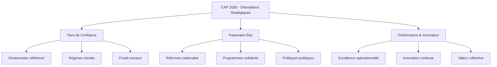

---

## Engagement durable et impact sociétal de la CDG et de la CNRA

### Un engagement structurant en faveur du développement durable

Le Maroc, sous la conduite éclairée de Sa Majesté le Roi Mohammed VI, a inscrit le développement durable au cœur de son modèle de croissance, en assurant l'équilibre entre les dimensions économiques, sociales et environnementales.

Comme l'a souligné Sa Majesté le Roi dans Son discours à l'occasion de la Fête du Trône (30 juillet 2016) :

> « Pour Nous, le développement se fonde sur la complémentarité et l'équilibre entre les dimensions économique, sociale et environnementale... »

 et les ODD pertinents)

Dans ce cadre, la Caisse de Dépôt et de Gestion, fidèle à son mandat public de long terme, a intégré très tôt ces enjeux dans ses orientations stratégiques. Institution de tiers de confiance, la CDG sécurise l'épargne réglementée et l'oriente vers des investissements générateurs de croissance socioéconomique responsable et durable, tout en assurant la préservation des équilibres environnementaux et sociaux.

Dès 2016, à l'occasion de la COP 22 à Marrakech, le Groupe CDG s'est résolument engagé à inscrire les enjeux climatiques et de durabilité au sein de ses priorités, en mettant en œuvre des démarches concrètes de réduction de son empreinte carbone et de contribution à la lutte contre le changement climatique.

La CDG a ainsi formalisé sa démarche dans une **Charte de Développement Durable**, couvrant l'ensemble des dimensions : sociales, économiques, environnementales et éthiques. Cette approche transversale s'aligne également sur les engagements du Nouveau Modèle de Développement du Royaume et permet au Groupe de contribuer activement à la réalisation des Objectifs de Développement Durable (ODD) des Nations Unies.

Le Groupe CDG concentre ainsi son action autour de trois enjeux structurants de la Stratégie Nationale de Développement Durable (SNDD) :

- **Réussir la transition** vers une économie verte ;
- **Accélérer la mise en œuvre** de la politique de lutte contre le changement climatique ;
- **Réduire les inégalités** sociales et territoriales.

### Une démarche structurée et des engagements concrets

La contribution de la CDG au développement durable repose sur cinq principes fondateurs :

- **Participer au développement économique et social** à long terme ;
- **Préserver les équilibres environnementaux** et climatiques ;
- **Promouvoir l'inclusion financière et sociale** au bénéfice des citoyens ;
- **Garantir une gouvernance exemplaire** et transparente ;
- **Valoriser et développer** le capital humain.

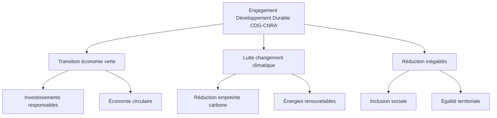

C'est dans cet esprit que la CNRA, opérant sous l'égide de la CDG, participe activement à la mise en œuvre de ces engagements à travers ses programmes de gestion des régimes de prévoyance, de protection sociale et d'accompagnement des politiques publiques.

---

## La CNRA aujourd'hui : 65 ans d'histoire, de missions et d'innovations

### Repères chronologiques

| **Année** | **Événements structurants** |
|-----------|------------------------------|
| **1959** | Création de la Caisse de Dépôt et de Gestion et attribution de la gestion de la Caisse Nationale de Retraites et d'Assurances (CNRA). |
| **1977** | Création du Régime Collectif d'Allocation de Retraite (RCAR) géré par la CNRA. |
| **1984** | Gestion des Rentes Accidents de la Circulation au profit des victimes mineures. |
| **1988** | Mise en place du Régime Complémentaire de Retraite (RECORE). |
| **1991** | Lancement du Fonds de Retraite des Ordres des Avocats du Maroc (FRAM). |
| **2001** | Lancement du programme de modernisation (SI, démarche qualité, orientation client). |
| **2004** | Certification ISO 9001 V2000 -- Rentes AT & AC. |
| **2006** | Certification ISO 9001 V2000 -- RECORE. |
| **2007** | Mise en production du SI IRADAT pour la gestion des rentes. |
| **2009** | 50ème anniversaire de la CNRA. |
| **2012** | Prise en charge du Fonds d'Entraide Familiale. Prix ONU pour l'initiative « Zéro papier ». |
| **2013** | Gestion des Fonds de Travail. |
| **2015** | Création du Fonds d'Aide aux Veuves et centralisation des Rentes AT/MP. |
| **2019** | 60ème anniversaire de la CNRA. |
| **2020** | Obtention de 3 certifications d'excellence de l'AISS et certification ISAE TYPE II. |
| **2021** | Nombreux certificats de mérite de l'AISS (gouvernance, client, gestion des risques, technologie de l'information). |
| **2022** | Nouvelles certifications d'excellence de l'AISS (erreurs, fraude, conformité), démarrage de la gestion du programme Tayssir. |
| **2023** | Gestion de trois chantiers majeurs : Aide au Logement, Aides Sociales Directes, et Séisme d'El Haouz. |
| **2024** | Prise en charge de l'indemnisation des sinistrés pour le compte du Fonds de Solidarité contre les Évènements Catastrophiques (FSEC). |

---

*Ce document constitue un témoignage vivant de l'évolution de la CNRA, institution au cœur du système marocain de prévoyance sociale, et de son engagement constant au service de la solidarité nationale et du développement socioéconomique du Royaume.*